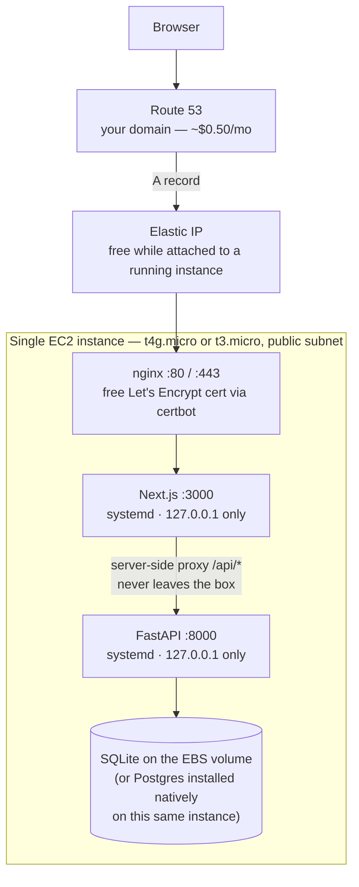

# Deploying CloudSolution Hub on AWS — minimal cost

This app is two processes talking over HTTP:

- **Frontend** — Next.js 15, built with `npm run build`, served with `npm start` (port 3000). It proxies `/api/*` to the backend server-side (`next.config.mjs`), so the browser only ever talks to the frontend's origin.
- **Backend** — FastAPI + Uvicorn (port 8000). Talks to Postgres (or SQLite — see below), optionally to LiteLLM (hosted LLM) or a local `claude` CLI subprocess, and writes uploaded files to local disk (`backend/uploads/`).

For a low-traffic internal tool, the standard "production" AWS shape (ALB + RDS + NAT Gateway) is overkill and is usually the majority of the bill — an ALB alone runs ~$16-20/month before any traffic, a NAT Gateway ~$32+/month, RDS `db.t3.micro` ~$12-15/month. None of those are required to run this app safely for a handful of internal users. Prices below are rough/list-price ballparks (check the [AWS Pricing Calculator](https://calculator.aws) for your exact region) — the point is the shape, not the exact numbers.

## The minimal-cost shape



No ALB, no NAT Gateway, no RDS, no separate frontend/backend instances. Everything runs on one box.

**Rough monthly cost**: one `t4g.micro` (~$6/mo on-demand, less/free if your account still has free-tier hours) + a 20GB gp3 EBS volume (~$1.60/mo) + Route 53 hosted zone (~$0.50/mo) + negligible data transfer for internal use ≈ **$8-10/month**, versus $70-100+/month for the ALB+RDS+NAT shape.

### What you give up to get this price

- **No high availability** — one instance, one disk. If it goes down, the app is down until you fix it. Acceptable for an internal tool with light usage; not acceptable if this becomes customer-facing with an uptime expectation.
- **SQLite instead of RDS** (if you go that route) — single-writer, backups are "copy the file," no automated point-in-time recovery. Fine for a small team; a real constraint if usage grows.
- **Manual TLS renewal** — certbot auto-renews via a cron job it installs, but there's no managed cert rotation the way ACM+ALB gives you for free.
- **No autoscaling** — if load grows past what a `t4g.micro`/`t3.micro` can handle, you resize the instance manually (a few minutes of downtime) rather than it happening automatically.

These are the right tradeoffs for "minimize billing" — just going in with eyes open about what's being traded away.

## Before you deploy: decide on the AI provider

- **LiteLLM mode** (hosted LLM + API key) works anywhere. Use this for AWS.
- **Claude CLI mode** shells out to a local `claude` binary using *your* logged-in session on *this* machine. It won't work on a fresh EC2 instance without repeating that login manually, and there's no cost benefit to it over LiteLLM (you still pay per-token via whatever plan is behind that login) — so for a cost-minimal deploy, just use LiteLLM with a `gpt-4o-mini`-class model, which is inexpensive per-request for occasional internal use.

## Step by step

### 1. Launch the EC2 instance

- **Instance type**: `t4g.micro` (Graviton/ARM, cheapest general-purpose) or `t3.micro` if you'd rather stay on x86 — either is plenty for a handful of concurrent internal users; this app is I/O-bound (waiting on the LLM API), not compute-bound.
- **AMI**: Amazon Linux 2023 (has an ARM variant, matching `t4g`) or Ubuntu 22.04.
- **Storage**: 20GB gp3 is enough for the OS, app, SQLite file, and uploaded documents for a while — resize later if needed, no need to over-provision now.
- **Networking**: public subnet (default VPC is fine), assign an **Elastic IP** so the address survives a stop/start.
- **Security group** — this is the important part, since there's no ALB in front to absorb the exposure:
  - `443` and `80` from `0.0.0.0/0` (80 only for the ACME HTTP-01 challenge / redirect to HTTPS)
  - `22` from **your IP only**, not `0.0.0.0/0`
  - nothing else open

### 2. Install dependencies

```bash
sudo dnf install -y python3.12 nodejs git nginx   # Amazon Linux 2023
# or: sudo apt install -y python3.12 python3.12-venv nodejs npm git nginx  # Ubuntu

git clone <your-repo-url> sa-generator
cd sa-generator/backend
python3.12 -m venv venv && source venv/bin/activate
pip install -r requirements.txt

cd ..
npm install
npm run build
```

### 3. Database — pick one

**Option A: SQLite (cheapest, simplest, recommended to start)**
Nothing to install — it's already what the app uses in dev. Just make sure `backend/.env` has `DATABASE_URL=sqlite:///./sagenerator.db` and that `backend/sagenerator.db` lives on the EBS volume (it does, by default). Back it up by copying that one file somewhere (S3, even just `scp` to your laptop periodically) — there's no automated backup story here, so do this manually on a schedule.

**Option B: Postgres, installed natively — still no RDS bill, no Docker either.** This is what `docs/main.tf` sets up automatically via `user_data` if you're using that Terraform file; the commands below are the same thing done by hand:
```bash
sudo dnf install -y postgresql16-server postgresql16
sudo postgresql-16-setup --initdb
sudo systemctl enable --now postgresql-16

# Default pg_hba.conf uses "ident" for local TCP connections — switch it to
# password auth, since the app connects via a postgresql:// URL, not the
# postgres OS user.
sudo sed -i -E 's/^(host[[:space:]]+all[[:space:]]+all[[:space:]]+127\.0\.0\.1\/32[[:space:]]+)ident$/\1scram-sha-256/' /var/lib/pgsql/data/pg_hba.conf
sudo systemctl restart postgresql-16

sudo -u postgres psql -c "CREATE USER sagen WITH PASSWORD '<choose-a-real-password>';"
sudo -u postgres createdb -O sagen sagenerator
```
Then set `DATABASE_URL=postgresql://sagen:<that-password>@localhost:5432/sagenerator` in `backend/.env`. This gets you Postgres's better concurrency/tooling without an RDS line item *or* a Docker layer — the tradeoff is you're responsible for backing it up yourself (`sudo -u postgres pg_dump sagenerator > backup.sql` on a cron job), since there's no RDS automated snapshot behind it.

### 4. Environment variables for production

| Variable | Production value |
|---|---|
| `DATABASE_URL` | `sqlite:///./sagenerator.db` (Option A) or the Postgres URL above (Option B) |
| `JWT_SECRET` | A fresh random secret for this environment: `python -c "import secrets; print(secrets.token_hex(32))"` |
| `ADMIN_USERNAME` / `ADMIN_PASSWORD` | Only used once by `python -m app.seed` to create the first Owner account — rotate the password after first login |
| `CORS_ORIGIN` | Your real domain, e.g. `https://sagen.yourcompany.com` |
| `LITELLM_MODEL` + provider key | See "AI provider" section above |
| `CLAUDE_CLI_PATH` | Leave unset in production |

For the frontend, set `BACKEND_URL=http://127.0.0.1:8000` (same instance).

### 5. Run both processes under systemd

```ini
# /etc/systemd/system/sagen-backend.service
[Unit]
Description=SA Generator backend
After=network.target

[Service]
WorkingDirectory=/home/ec2-user/sa-generator/backend
ExecStart=/home/ec2-user/sa-generator/backend/venv/bin/uvicorn app.main:app --host 127.0.0.1 --port 8000
Restart=on-failure
EnvironmentFile=/home/ec2-user/sa-generator/backend/.env

[Install]
WantedBy=multi-user.target
```

```ini
# /etc/systemd/system/sagen-frontend.service
[Unit]
Description=SA Generator frontend
After=network.target sagen-backend.service

[Service]
WorkingDirectory=/home/ec2-user/sa-generator
ExecStart=/usr/bin/npm start
Restart=on-failure
Environment=BACKEND_URL=http://127.0.0.1:8000

[Install]
WantedBy=multi-user.target
```

```bash
sudo systemctl enable --now sagen-backend sagen-frontend
```

Both bind to `127.0.0.1` only — nginx is the one thing actually exposed to the internet.

### 6. nginx + free TLS via Let's Encrypt

```bash
sudo dnf install -y certbot python3-certbot-nginx
```

```nginx
# /etc/nginx/conf.d/sagen.conf
server {
    listen 80;
    server_name sagen.yourcompany.com;

    location / {
        proxy_pass http://127.0.0.1:3000;
        proxy_set_header Host $host;
        proxy_set_header X-Forwarded-For $proxy_add_x_forwarded_for;
        proxy_set_header X-Forwarded-Proto $scheme;
    }
}
```

```bash
sudo systemctl enable --now nginx
sudo certbot --nginx -d sagen.yourcompany.com   # gets a free cert, rewrites the config for HTTPS, sets up a renewal cron job
```

Point your domain at the instance's Elastic IP with a Route 53 `A` record, then update `CORS_ORIGIN` in `backend/.env` to `https://sagen.yourcompany.com` and restart the backend service.

### 7. First run

```bash
cd backend
source venv/bin/activate
python -m app.seed   # creates tables and seeds the default admin account
```

Log in as `admin`, then immediately use Users → Actions → Reset Password on that account so the deploy-time password isn't the long-term one.

## When you outgrow this

Signs you've genuinely outgrown the single-instance shape: real concurrent load causing the instance to struggle, needing uptime guarantees, or the team growing past what SQLite/manual-Postgres-backups can comfortably handle. At that point, move to RDS (managed backups/Multi-AZ) and an ALB+ACM (managed TLS, health-check-based failover) — the same pieces described in most standard AWS deployment guides. Don't pay for that shape before you need it.

## Post-deploy checklist

- [ ] `curl https://sagen.yourcompany.com/api/health` returns `{"status":"ok"}`
- [ ] `CORS_ORIGIN` matches the real domain (verify by logging in from a browser, not just curl)
- [ ] `JWT_SECRET` is a fresh value, not copied from a dev `.env`
- [ ] AI provider set to LiteLLM in Settings, with a working API key
- [ ] Default admin password rotated
- [ ] A manual or cron-scheduled backup of the SQLite file (or `pg_dump` if using Option B) actually exists somewhere off the instance
- [ ] Security group confirmed: only 80/443 open publicly, 22 restricted to your IP

## Known gaps to be aware of

- Single point of failure by design (that's the cost tradeoff) — if the instance or its EBS volume is lost without a backup, data is gone.
- No malware/virus scanning on uploaded files.
- Login rate limiting (`backend/app/rate_limit.py`) is in-memory in the backend process — a backend restart clears it. Fine at this scale.
- File uploads live on the instance's local disk, not S3 — fine for one instance, would need code changes to support multiple instances later.
